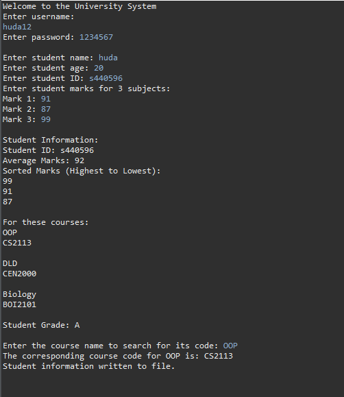

# Student Information System

A Java-based student information management system developed using object-oriented programming concepts.

---

## Project Overview

The Student Information System is a console-based Java application designed to manage student records, calculate grades, sort marks, and search course information.

The project focuses on applying object-oriented programming principles and data management concepts using Java.

---

## Features

- Student information management
- Grade calculation
- Average mark calculation
- Mark sorting
- Course code searching
- File handling and export
- Console-based interaction

---

## Technologies Used

- Java
- Object-Oriented Programming (OOP)

---

## OOP Concepts Applied

- Classes and Objects
- Inheritance
- Encapsulation
- Arrays
- File Handling

---

## Main Functionalities

### Student Data Management
Stores:
- Student name
- Student ID
- Age
- Grades

### Grade Processing
The system:
- Calculates average marks
- Sorts marks from highest to lowest
- Assigns grades

### Course Search
Users can search for course names to retrieve corresponding course codes.

### File Handling
Student information can be exported to a text file.

---

## Program Output

### Console Output


---

## Project Structure

```txt
student-information-system-java/
│
├── src/
└── sample-output/
